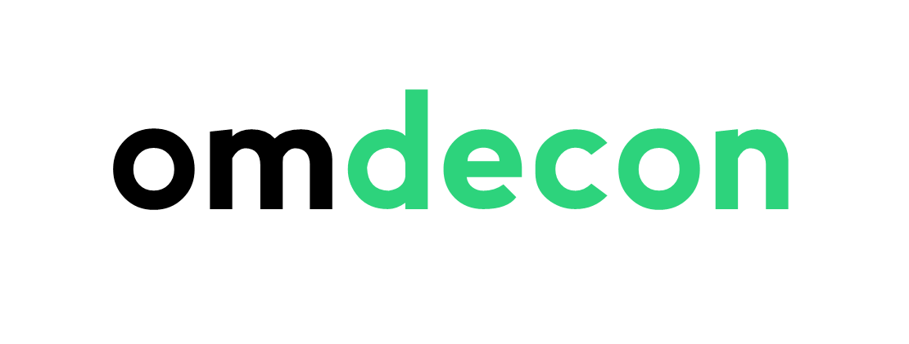

# omdecon // image deconvolution on the OMERO server

omdecon is a simple image processing tool. It runs a state-of-the-art open-source image denoising method, **[AIDA, the Adaptative Image Deconvolution Algorithm](https://www.ncbi.nlm.nih.gov/pmc/articles/PMC3166524/)** over the [OMERO server](http://www.openmicroscopy.org/site/products/omero).

As an added convenience, I also included a simple way to produce theoretical point-like objects, or PSFs, using Christoph Gohlke's **[PSF module](http://www.lfd.uci.edu/~gohlke/code/psf.py.html)**. There's two different ways to use this module through omdecon:
 
**Manually set your PSF:** Enter all the information about your experiment, such as the technique and the different channels you used.
  
**Automatically set your PSF:** For this, your images will have to be tagged with the proper metadata:
  - Objective name (from which omdecon deduces immersion medium and technique used)
  - Numerical Aperture
  - Channel excitation and emission

Installation instructions to follow.
